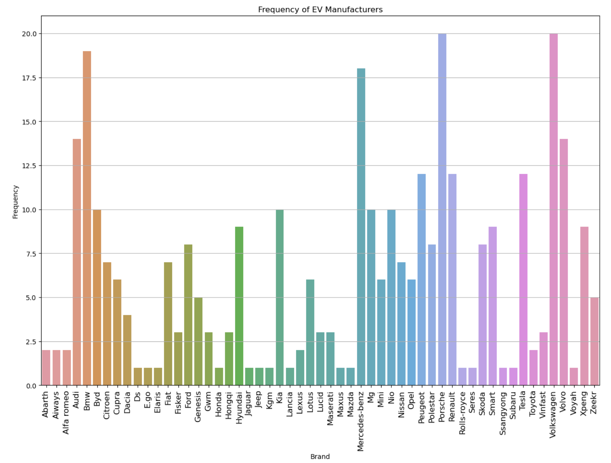
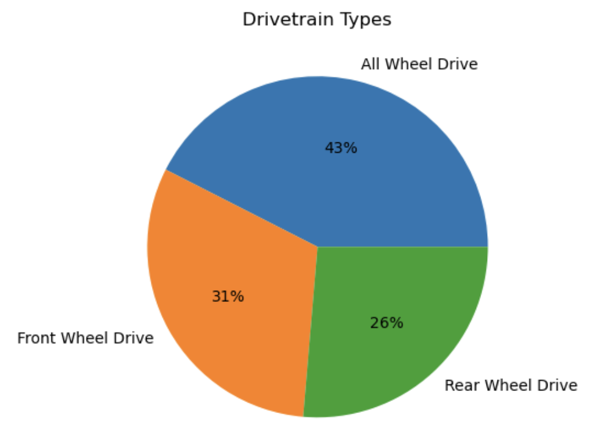
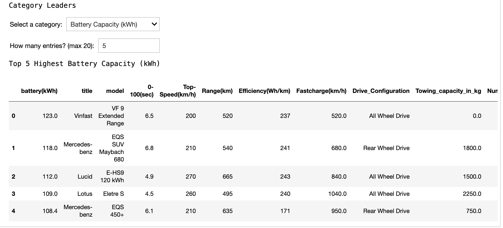
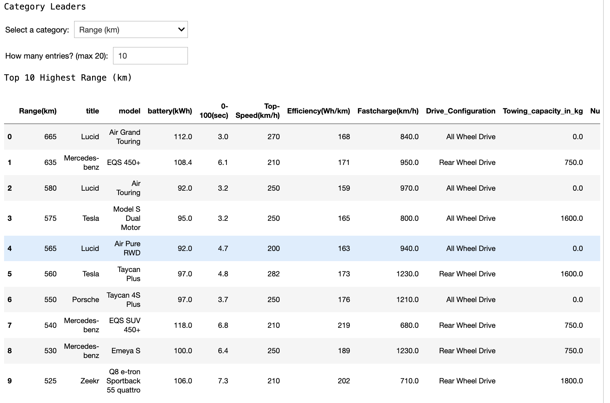

# Electric-Vehicle-Analysis
##### Shlok Yeolekar
##### June 2024

## Description
This jupyter notebook tool uses data from every production electric vehicle to visualize statistics about performance, pricing, efficiency, charging, and more. The tool can be used to compare different features from electric cars to make informed decisions or just learn more about some of the offerings from each manufacturer. 

## Instructions
- Download the .ipynb (Jupyter Notebook) file and run it in your own instance of Jupyter Notebook.
- It can be previewed through GitHub but many of the features such as the dropdown menu will not work. 

## Generated Graphs Include: 
- EV Manufacturer Count (How many EVs each brand makes)
- Highest ____ Achieved By Each Brand (____ can be user-selected; Ex: Top Speed, Efficiency, Range, etc.)
- Number of Seats
- Drivetrain Type
- Best in Class (Top ___ Most ____ Cars)
  - For example, Top 10 Most Efficient Cars, or Top 3 Most Expensive Cars. Blanks can be user selected

## Requirements
This can be run in Jupyter Notebook which will require installing Anaconda. You can also find online Jupyter Notebook compilers

## Screenshots

---

---

---

___

___

---

---
